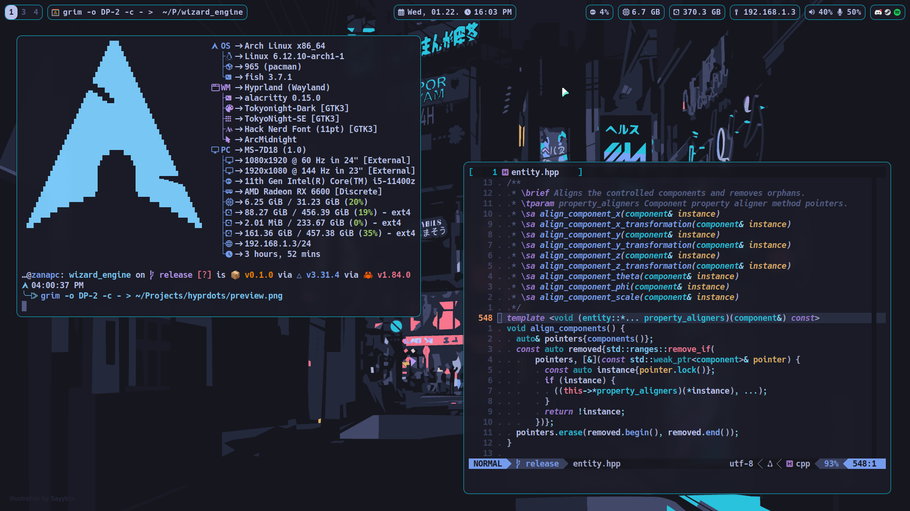

> Wallpaper: [$HOME/.config/hypr/wallpaper.jpg](./home/.config/hypr/wallpaper.jpg)

# [Packages (865)](./pkgs.lock)

### Prerequisites

| Package                           | Description                              |
|:---------------------------------:|:-----------------------------------------|
| git                               | Version control system                   |
| yay                               | AUR package manager                      |

### Desktop

| Package                           | Description                              |
|:---------------------------------:|:-----------------------------------------|
| asusctl (AUR)                     | ASUS control daemon                      |
| brightnessctl                     | Brightness manager                       |
| fuzzel                            | Application launcher                     |
| grim                              | Screenshot tool                          |
| hyprland                          | Tiling compositor                        |
| network-manager-applet            | NetworkManager applet                    |
| noto-fonts                        | Font provider                            |
| noto-fonts-emoji                  | Colored emoji font                       |
| nvidia-open                       | Proprietary NVIDIA driver for Linux      |
| pavucontrol                       | Audio manager                            |
| slurp                             | Area selector                            |
| swaybg                            | Wallpaper tool                           |
| ttf-hack-nerd                     | Source code font                         |
| vulkan-radeon                     | AMD Vulkan provider                      |
| waybar                            | Status bar                               |
| wl-clipboard                      | Clipboard manager                        |
| xdg-desktop-portal-hyprland       | Screen sharing tool                      |

### Terminal

| Package                           | Description                              |
|:---------------------------------:|:-----------------------------------------|
| fastfetch                         | System information                       |
| fish                              | Smart shell                              |
| foot                              | Terminal emulator                        |
| starship                          | Improved prompt                          |
| tmux                              | Terminal multiplexer                     |
| zoxide                            | Smart cd                                 |

### CLI tools

| Package                           | Description                              |
|:---------------------------------:|:-----------------------------------------|
| btop                              | Resource monitor                         |
| fzf                               | Fuzzy finder                             |
| man-db                            | Manual pages implementation              |
| man-pages                         | Linux/POSIX manual pages                 |
| ripgrep                           | Recursive search tool                    |
| rocm-smi-lib                      | AMD GPU support for BTOP                 |
| smartmontools                     | Disk monitoring tool                     |
| tree                              | Recursive directory listing              |

### Editor

| Package                           | Description                              |
|:---------------------------------:|:-----------------------------------------|
| neovim                            | Vim-based text editor                    |
| tree-sitter-cli                   | Improved syntax highlighting for NeoVim  |

### Archiving

| Package                           | Description                              |
|:---------------------------------:|:-----------------------------------------|
| 7zip                              | 7-Zip support for atool                  |
| atool                             | Archive manager                          |
| unrar                             | RAR support for atool                    |
| unzip                             | ZIP support for atool                    |
| zip                               | ZIP support for atool                    |

### Programming

| Package                           | Description                              |
|:---------------------------------:|:-----------------------------------------|
| aarch64-linux-gnu-gcc             | ARM64 compiler for C, C++                |
| android-aarch64-gtest (AUR)       | GoogleTest for ARM64 Android             |
| android-aarch64-sdl3 (AUR)        | SDL3 for x86-64 Android                  |
| android-sdk (AUR)                 | Android development kit                  |
| android-x86-64-gtest (AUR)        | GoogleTest for x86-64 Android            |
| android-x86-64-sdl3 (AUR)         | SDL3 for x86-64 Android                  |
| cmake                             | C, C++ build tool                        |
| cppreference (AUR)                | Comprehensive C++ reference              |
| directx-shader-compiler-git (AUR) | Vulkan/DirectX shader compiler           |
| docker-compose                    | Docker orchestration tool                |
| docker-rootless-extras (AUR)      | Rootless Docker                          |
| doxygen                           | Documentation generator                  |
| jdk21-openjdk                     | Java 21 development kit                  |
| jdk8-openjdk                      | Java 8 development kit                   |
| linux-headers                     | Linux kernel headers                     |
| lld                               | LLVM linker                              |
| mingw-w64-gcc                     | x86-64 Windows compiler for C, C++       |
| mingw-w64-gtest (AUR)             | GoogleTest for x86-64 Windows            |
| mingw-w64-sdl3 (AUR)              | SDL3 for x86-64 Windows                  |
| ninja                             | Performant CMake generator               |
| npm                               | Node Package Manager                     |
| perf                              | Performance auditing tool                |
| qemu-desktop                      | Virtualization tool                      |
| renderdoc                         | OpenGL and Vulkan debugging tool         |
| rpi-imager                        | Raspberry Pi imager                      |
| rustup                            | Rust toolchain installer                 |
| v4l2loopback-dkms                 | V4L2 loopback kernel module              |
| valgrind                          | Debugging tool for C, C++                |
| vulkan-validation-layers          | Vulkan validation layers                 |

### Media

| Package                           | Description                              |
|:---------------------------------:|:-----------------------------------------|
| chromium                          | Web browser                              |
| gimp                              | Image manipulation program               |
| texlive-fontsrecommended          | LaTeX - essential fonts                  |
| texlive-langenglish               | LaTeX - language support                 |
| texlive-langeuropean              | LaTeX - language support                 |
| texlive-latexextra                | LaTeX - core packages                    |
| wf-recorder                       | Screen recorder                          |

### Entertainment

| Package                           | Description                              |
|:---------------------------------:|:-----------------------------------------|
| atlauncher-bin (AUR)              | Minecraft launcher                       |

### Compatibility

| Package                           | Description                              |
|:---------------------------------:|:-----------------------------------------|
| dosfstools                        | FAT compatibility tool                   |
| exfatprogs                        | exFAT compatibility tool                 |
| ntfs-3g                           | NTFS compatibility tool                  |
| wine-mono                         | Windows compatibility layer              |

# Manual setup

#### $HOME/.local/bin/android_emulator

- -camera-back webcamX

#### $HOME/.local/bin/screen_camera

- video_nr=X

#### chromium/discord

- Appearance: Chat Font Scaling: 20px
- Show Member List

#### git

- git config --global user.email
- git config --global user.name
- Generate new token (classic)

#### openssh

- "$HOME/.ssh/config"

#### qemu-desktop

- "$HOME/Qemu/**/*.img"
